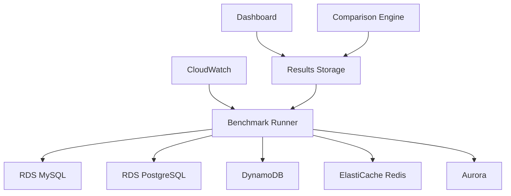

# AWS Database Benchmarking Suite

#### Overview
In this workshop, you will build a comprehensive benchmarking suite to test the performance of various AWS database services under different workloads. You will learn how to design and deploy an automated benchmarking system, compare results, detect performance regressions, and create reporting dashboards.

#### Learning Objectives
- Understand major AWS database services (RDS, DynamoDB, Aurora, ElastiCache)
- Design standardized testing methodology for database performance
- Build automated benchmark execution system
- Create result comparison tools and regression detection
- Design reporting dashboard
- Write best practices documentation

#### Prerequisites
- Basic understanding of AWS services (EC2, IAM, CloudWatch)
- Knowledge of database concepts
- Experience with Python or Node.js
- Understanding of performance testing concepts

#### Estimated Time
- **Lab 5.1**: 30 minutes - Setup environment and infrastructure
- **Lab 5.2**: 45 minutes - Design benchmark methodology
- **Lab 5.3**: 60 minutes - Build automated testing framework
- **Lab 5.4**: 45 minutes - Create comparison tools and regression detection
- **Lab 5.5**: 30 minutes - Build reporting dashboard
- **Lab 5.6**: 30 minutes - Write best practices documentation

#### Estimated Cost
- **RDS instances**: ~$50-100 (depending on instance type and usage time)
- **DynamoDB**: ~$10-20 (for testing workload)
- **EC2 instances**: ~$20-40 (for benchmark runner)
- **CloudWatch**: ~$5-10
- **Total**: ~$85-170 for entire workshop

{}
**Important Note**: This workshop will create AWS resources that incur costs. Please ensure to delete all resources after completion to avoid unnecessary charges.
{}

#### Main Content

1. [Setup Infrastructure and Environment](5.1-setup-infrastructure/)
2. [Design Benchmark Methodology](5.2-benchmark-methodology/)
3. [Build Automated Testing Framework](5.3-automated-framework/)
4. [Create Comparison Tools and Regression Detection](5.4-comparison-tools/)
5. [Build Reporting Dashboard](5.5-reporting-dashboard/)
6. [Write Best Practices Documentation](5.6-best-practices/)

#### Overall Architecture

#### AWS Services to be used
- **EC2**: Benchmark runner instances
- **RDS**: MySQL, PostgreSQL, Aurora databases
- **DynamoDB**: NoSQL database testing
- **ElastiCache**: Redis caching layer
- **CloudWatch**: Monitoring and metrics
- **S3**: Store benchmark results
- **Lambda**: Automated cleanup and processing
- **IAM**: Security and permissions 