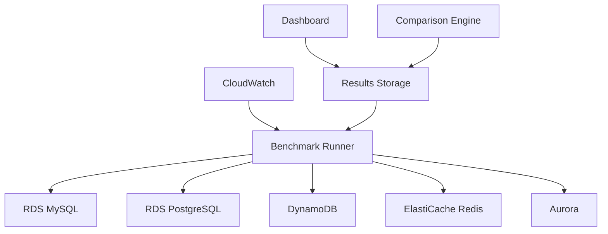

# AWS Database Benchmarking Suite - Bộ công cụ đánh giá hiệu năng cơ sở dữ liệu AWS

#### Tổng quan
Trong workshop này, bạn sẽ xây dựng một bộ công cụ comprehensive để test performance của các AWS database services khác nhau dưới các workload khác nhau. Bạn sẽ học cách thiết kế và triển khai một hệ thống benchmarking tự động, so sánh kết quả, phát hiện performance regression, và tạo báo cáo dashboard.

#### Mục tiêu học tập
- Hiểu về các AWS database services chính (RDS, DynamoDB, Aurora, ElastiCache)
- Thiết kế methodology testing chuẩn hóa cho database performance
- Xây dựng automated benchmark execution system
- Tạo tools so sánh kết quả và phát hiện regression
- Thiết kế reporting dashboard
- Viết best practices documentation

#### Kiến thức cần thiết
- Hiểu cơ bản về AWS services (EC2, IAM, CloudWatch)
- Kiến thức về database concepts
- Kinh nghiệm với Python hoặc Node.js
- Hiểu về performance testing concepts

#### Thời gian ước tính
- **Lab 5.1**: 30 phút - Setup môi trường và infrastructure
- **Lab 5.2**: 45 phút - Thiết kế benchmark methodology
- **Lab 5.3**: 60 phút - Xây dựng automated testing framework
- **Lab 5.4**: 45 phút - Tạo comparison tools và regression detection
- **Lab 5.5**: 30 phút - Xây dựng reporting dashboard
- **Lab 5.6**: 30 phút - Viết best practices documentation

#### Chi phí ước tính
- **RDS instances**: ~$50-100 (tùy theo instance type và thời gian sử dụng)
- **DynamoDB**: ~$10-20 (cho testing workload)
- **EC2 instances**: ~$20-40 (cho benchmark runner)
- **CloudWatch**: ~$5-10
- **Tổng cộng**: ~$85-170 cho toàn bộ workshop

{}
**Lưu ý quan trọng**: Workshop này sẽ tạo ra các AWS resources có tính phí. Hãy đảm bảo xóa tất cả resources sau khi hoàn thành để tránh phát sinh chi phí không cần thiết.
{}

#### Nội dung chính

1. [Thiết lập Infrastructure và Môi trường](5.1-setup-infrastructure/)
2. [Thiết kế Benchmark Methodology](5.2-benchmark-methodology/)
3. [Xây dựng Automated Testing Framework](5.3-automated-framework/)
4. [Tạo Comparison Tools và Regression Detection](5.4-comparison-tools/)
5. [Xây dựng Reporting Dashboard](5.5-reporting-dashboard/)
6. [Viết Best Practices Documentation](5.6-best-practices/)

#### Kiến trúc tổng thể

#### Các AWS Services sẽ sử dụng
- **EC2**: Benchmark runner instances
- **RDS**: MySQL, PostgreSQL, Aurora databases
- **DynamoDB**: NoSQL database testing
- **ElastiCache**: Redis caching layer
- **CloudWatch**: Monitoring và metrics
- **S3**: Lưu trữ benchmark results
- **Lambda**: Automated cleanup và processing
- **IAM**: Security và permissions 